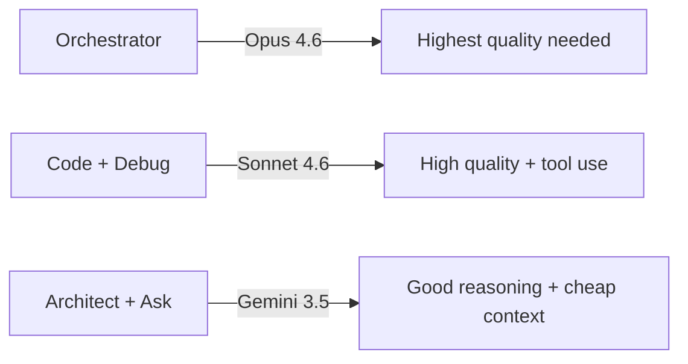

# Roo Code Model Assignment Guide

Recommended VS Code LM API model assignments per Roo Code mode, optimized for effectiveness × token efficiency.

## Exported Settings

The Roo Code configuration implementing these assignments is saved at [`coding-env-setup/roo-code-settings.json`](coding-env-setup/roo-code-settings.json). Import via Roo Code settings → "Import Settings".

## Recommended Configuration

| Mode | Recommended Model | Rationale |
|------|------------------|-----------|
| **🏗️ Architect** | Gemini 3.5 | Massive context window, strong reasoning for planning/design. Cheap per token. Planning doesn't need tool-use precision. |
| **💻 Code** | Claude Sonnet 4.6 | Best balance: strong coding, good tool use, follows instructions precisely. Opus overkill for most impl tasks. |
| **❓ Ask** | Gemini 3.5 or GPT-4o Mini | Read-heavy, explanation tasks. Cheap models handle well. No tool-use precision needed. |
| **🪲 Debug** | Claude Sonnet 4.6 | Needs precise reasoning + tool use for systematic debugging. Sonnet handles this well. |
| **🪃 Orchestrator** | Claude Opus 4.6 | Complex multi-step coordination, task decomposition, subtask delegation. Worth premium here — orchestrator drives everything. |

## Key Principles

1. **Opus** → reserve for orchestration/complex reasoning only. Token-expensive, overkill for standard coding.
2. **Sonnet 4.6** → workhorse for Code + Debug. Best tool-use compliance in Claude family at reasonable cost.
3. **Gemini 3.5** → massive context window makes it ideal for Architect (large codebase planning) and Ask (reading/explaining). Cheap.
4. **GPT-4o Mini** → viable for Ask mode if you want even cheaper. Not recommended for Code/Debug (weaker tool-use adherence).
5. **Haiku** → too weak for agentic coding tasks. Skip for all modes unless you add a "quick edit" mode for trivial changes.

## Cost-to-Quality Tiers

## Budget Alternative

If minimizing spend is priority over peak quality:

| Mode | Budget Pick |
|------|-------------|
| Architect | Gemini 3.5 |
| Code | Claude Sonnet 4.6 |
| Ask | GPT-4o Mini |
| Debug | Claude Sonnet 4.6 |
| Orchestrator | Claude Sonnet 4.6 (downgrade from Opus) |

## Notes

- Caveman + RTK setup already saves 60-75% on output tokens → amplifies savings on expensive models.
- Sonnet 4.6 with caveman instructions ≈ Opus-quality output at ~1/5 cost.
- Gemini 3.5's 1M+ context window = can hold entire codebase for architectural planning without chunking.
- GPT-5 full → comparable to Opus but more expensive via Copilot API. Skip unless specific OpenAI tool-use features needed.

## Available Models Reference

As of 2025-06:

- Claude Opus (up to 4.8)
- Claude Sonnet (up to 4.6)
- Claude Haiku (up to 4.5)
- Gemini 3.5
- GPT-4o / GPT-4o Mini
- GPT-5 / GPT-5 Mini
