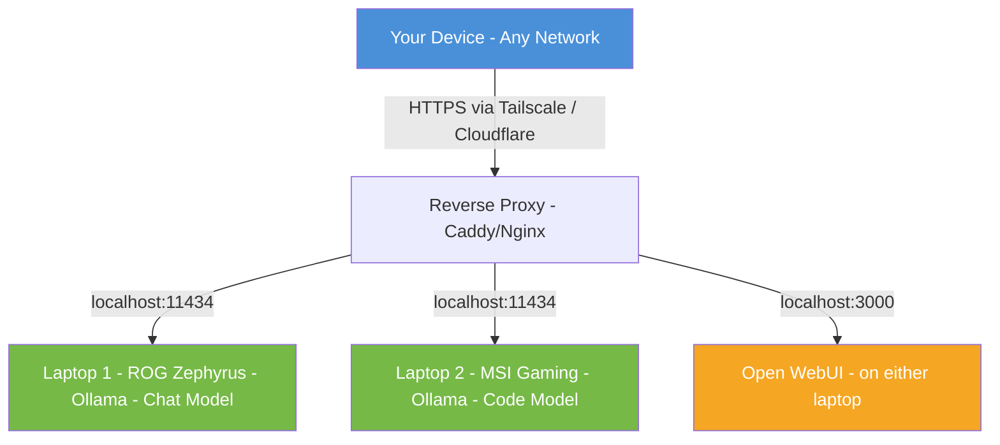
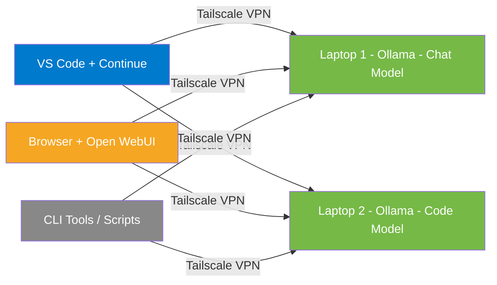

# Local LLM Server Plan — Gaming Laptop Fleet

## Overview

Set up two gaming laptops (ASUS ROG Zephyrus + MSI Gaming) as dedicated local LLM inference servers, accessible remotely from any network with basic security.

**Assumed Hardware:**
- GPUs: NVIDIA RTX 3060–4070 range (6–12 GB VRAM)
- System RAM: 16–32 GB
- Storage: 512 GB+ SSD recommended

---

## 1. Operating System — Ubuntu Server Minimal

### Recommendation: **Ubuntu Server 24.04 LTS (Noble Numbat)**

Ubuntu Server installs with **no desktop environment** by default — it is already a minimal distro. This is preferable over Ubuntu Desktop with a minimal install because:

- No X11/Wayland, no compositor, no window manager consuming VRAM/RAM
- Typical idle memory usage: **~300–500 MB** vs **~1.5–2 GB** with a desktop
- No GPU resources wasted on display rendering
- Systemd services for auto-start of LLM servers on boot

### Alternative Minimal Options Considered

| Distro | Pros | Cons |
|--------|------|------|
| **Ubuntu Server 24.04 LTS** ⭐ | Best NVIDIA driver support, huge community, `apt` ecosystem, 5-year support | Slightly larger than Arch minimal |
| **Ubuntu Minimal Cloud Image** | Even smaller footprint | Designed for cloud/VMs, awkward on bare metal |
| **Debian 12 Minimal** | Rock-solid, very minimal | NVIDIA driver support is more manual, older packages |
| **Arch Linux** | Absolute minimal, rolling release | High maintenance, no LTS, not beginner-friendly |
| **Fedora Server** | Modern packages, good NVIDIA support via RPM Fusion | Shorter support cycle, 13-month lifecycle |

### Key Setup Steps

1. Download Ubuntu Server 24.04 LTS ISO
2. Create bootable USB with `dd`, Balena Etcher, or Rufus
3. Install with minimal options — no snaps, no desktop
4. Enable SSH during install
5. Post-install essentials:
   ```bash
   sudo apt update && sudo apt upgrade -y
   sudo apt install -y build-essential git curl wget htop tmux ufw openssh-server
   ```
6. Disable unnecessary services:
   ```bash
   sudo systemctl disable snapd
   sudo systemctl disable ModemManager
   sudo systemctl disable bluetooth
   ```

### Laptop-Specific Concerns

- **Lid close behavior** — Set to ignore so laptops run headless with lid closed:
  ```bash
  # /etc/systemd/logind.conf
  HandleLidSwitch=ignore
  HandleLidSwitchExternalPower=ignore
  HandleLidSwitchDocked=ignore
  ```
- **Thermal management** — Gaming laptops have aggressive thermal profiles. Install monitoring:
  ```bash
  sudo apt install -y lm-sensors
  sudo sensors-detect
  ```
- **Power management** — Keep plugged in at all times. Consider setting a battery charge limit if BIOS supports it.

---

## 2. GPU Drivers and CUDA

### NVIDIA Driver Installation

```bash
# Add NVIDIA driver PPA
sudo add-apt-repository ppa:graphics-drivers/ppa -y
sudo apt update

# Install the recommended driver
ubuntu-drivers devices          # Check recommended version
sudo ubuntu-drivers autoinstall # Auto-install best match

# Or pin a specific version
sudo apt install -y nvidia-driver-560

# Reboot and verify
sudo reboot
nvidia-smi
```

### CUDA Toolkit

Most LLM inference engines bundle their own CUDA runtime, but installing the toolkit is helpful:

```bash
# Install CUDA toolkit (matches driver version)
sudo apt install -y nvidia-cuda-toolkit

# Verify
nvcc --version
```

> **Note:** Tools like Ollama and llama.cpp ship their own CUDA binaries, so a full CUDA install is optional. `nvidia-smi` working is the critical gate.

---

## 3. LLM Inference Engines — Comparison

This is the core decision. Here are the leading options:

### Quick Comparison

| Engine | Ease of Use | Performance | API Compatibility | GPU Offloading | Multi-GPU | Best For |
|--------|-------------|-------------|-------------------|----------------|-----------|----------|
| **Ollama** ⭐ | ★★★★★ | ★★★★ | OpenAI-compatible | Automatic | Yes | Getting started fast, daily use |
| **llama.cpp / llama-server** | ★★★ | ★★★★★ | OpenAI-compatible | Manual layers | Yes | Maximum performance, fine control |
| **vLLM** | ★★★ | ★★★★★ | OpenAI-compatible | Full | Yes | High-throughput production serving |
| **LocalAI** | ★★★★ | ★★★★ | OpenAI-compatible | Via backends | Yes | Drop-in OpenAI API replacement |
| **text-generation-webui** (oobabooga) | ★★★★ | ★★★ | Partial | Via backends | Limited | Web-based chat UI with model swapping |
| **LM Studio** | ★★★★★ | ★★★★ | OpenAI-compatible | Automatic | No | Desktop GUI (requires display) |

### Detailed Breakdown

#### Ollama (Recommended Starting Point)
- **What:** All-in-one LLM runtime with built-in model management
- **Install:** Single command: `curl -fsSL https://ollama.ai/install.sh | sh`
- **API:** OpenAI-compatible REST API on port `11434`
- **Strengths:**
  - Dead-simple model pulling: `ollama pull llama3.1:8b`
  - Automatic GPU detection and VRAM management
  - Runs as a systemd service
  - Huge model library (Llama, Mistral, CodeLlama, Qwen, DeepSeek, etc.)
  - Supports custom Modelfiles for system prompts and parameters
- **Weaknesses:**
  - Less tuning granularity than raw llama.cpp
  - Single-model-at-a-time by default (can be configured for concurrent)

#### llama.cpp / llama-server
- **What:** High-performance C++ inference engine (Ollama is built on this)
- **Install:** Build from source or use pre-built binaries
- **API:** Built-in OpenAI-compatible server mode
- **Strengths:**
  - Maximum performance and control
  - Granular GPU layer offloading (`-ngl` flag)
  - Supports GGUF quantized models
  - Lower overhead than Ollama
- **Weaknesses:**
  - Manual model management
  - More CLI flags to learn

#### vLLM
- **What:** High-throughput serving engine with PagedAttention
- **Install:** `pip install vllm`
- **Strengths:**
  - Best throughput for concurrent requests
  - Production-grade serving
  - Continuous batching
- **Weaknesses:**
  - Higher VRAM requirements (prefers unquantized models)
  - Heavier dependency stack (Python, PyTorch)
  - May be overkill for 1-2 user setup

#### LocalAI
- **What:** Drop-in OpenAI API replacement supporting multiple backends
- **Install:** Docker container or binary
- **Strengths:**
  - True OpenAI API compatibility (including embeddings, TTS, image gen)
  - Multiple backend support
- **Weaknesses:**
  - More complex configuration
  - Docker adds overhead

### Recommendation

**Start with Ollama** for simplicity. If you need more performance tuning later, switch to raw `llama-server` from llama.cpp. Both expose OpenAI-compatible APIs, so your client code won't change.

---

## 4. Model Selection by VRAM

VRAM is the primary constraint. Here's what fits:

### 6 GB VRAM (RTX 3060 Laptop, RTX 4060)

| Model | Parameters | Quantization | VRAM Usage | Quality |
|-------|-----------|--------------|------------|---------|
| Llama 3.1 8B | 8B | Q4_K_M | ~5.0 GB | Good |
| Mistral 7B v0.3 | 7B | Q4_K_M | ~4.5 GB | Good |
| DeepSeek-Coder-V2-Lite | 16B | Q3_K_M | ~5.5 GB | Good for code |
| Qwen 2.5 7B | 7B | Q4_K_M | ~4.5 GB | Good |
| Phi-3 Mini 3.8B | 3.8B | Q4_K_M | ~2.5 GB | Decent |

### 8 GB VRAM (RTX 3070, RTX 4060 Ti)

| Model | Parameters | Quantization | VRAM Usage | Quality |
|-------|-----------|--------------|------------|---------|
| Llama 3.1 8B | 8B | Q5_K_M | ~5.8 GB | Very Good |
| Mistral Nemo 12B | 12B | Q4_K_M | ~7.5 GB | Very Good |
| CodeLlama 13B | 13B | Q4_K_M | ~7.8 GB | Good for code |
| DeepSeek-Coder 6.7B | 6.7B | Q5_K_M | ~5.0 GB | Good for code |

### 12 GB VRAM (RTX 3060 12GB Desktop-class, RTX 4070)

| Model | Parameters | Quantization | VRAM Usage | Quality |
|-------|-----------|--------------|------------|---------|
| Llama 3.1 8B | 8B | Q8_0 | ~8.5 GB | Excellent |
| Qwen 2.5 14B | 14B | Q4_K_M | ~9.0 GB | Very Good |
| DeepSeek-Coder-V2 16B | 16B | Q4_K_M | ~10 GB | Excellent for code |
| Mistral Nemo 12B | 12B | Q6_K | ~10 GB | Excellent |
| Llama 3.1 70B | 70B | Q2_K | ~11.5 GB | Usable (quality tradeoff) |

### Key Quantization Guidance

- **Q4_K_M** — Best balance of quality vs size (sweet spot)
- **Q5_K_M** — Noticeable quality improvement, ~20% more VRAM
- **Q8_0** — Near-original quality, if VRAM allows
- **Q3_K_M / Q2_K** — Use only when you need to squeeze a larger model in; quality degrades

### Recommended Setup

- **Laptop 1 (General Chat):** Llama 3.1 8B or Qwen 2.5 at best quantization your VRAM allows
- **Laptop 2 (Code):** DeepSeek-Coder-V2-Lite or CodeLlama at best quantization

---

## 5. API Server and Web UI Options

### API Layer (comes with your inference engine)

Both Ollama and llama-server expose **OpenAI-compatible APIs** by default:

```bash
# Ollama API example
curl http://localhost:11434/v1/chat/completions \
  -H "Content-Type: application/json" \
  -d '{"model": "llama3.1:8b", "messages": [{"role": "user", "content": "Hello"}]}'
```

### Web UIs (Optional, for browser-based chat)

| UI | Type | Ollama Support | Features |
|----|------|---------------|----------|
| **Open WebUI** ⭐ | Self-hosted web app | Native | ChatGPT-like interface, multi-user, RAG, model management |
| **SillyTavern** | Self-hosted web app | Yes | Roleplay-focused, character cards |
| **LibreChat** | Self-hosted web app | Yes | Multi-provider, plugins |
| **Chatbot UI** | Self-hosted web app | Yes | Clean, simple ChatGPT clone |

### Recommendation: Open WebUI

```bash
# Install with Docker (lightweight)
docker run -d -p 3000:8080 \
  --add-host=host.docker.internal:host-gateway \
  -v open-webui:/app/backend/data \
  --name open-webui \
  --restart always \
  ghcr.io/open-webui/open-webui:main
```

- Full ChatGPT-like experience in the browser
- Built-in user authentication
- Can connect to both Ollama instances simultaneously
- Supports RAG (document upload and Q&A)
- Mobile-friendly

---

## 6. Remote Access Architecture

### Architecture Diagram



### Option A: Tailscale (Recommended)

**Tailscale** creates a WireGuard-based mesh VPN. Zero port forwarding, zero firewall holes.

```bash
# Install on each laptop
curl -fsSL https://tailscale.com/install.sh | sh
sudo tailscale up

# Install on your client devices too
# Each device gets a stable IP like 100.64.x.x
```

**Why Tailscale:**
- Free for personal use (up to 100 devices)
- No ports opened on your home router
- End-to-end encrypted (WireGuard)
- Works across NATs, firewalls, cellular networks
- MagicDNS: access by hostname (e.g., `http://rog-zephyrus:11434`)
- ACLs for access control
- Funnel feature can optionally expose services to the public internet

### Option B: Cloudflare Tunnel

Free alternative that creates outbound-only tunnels:

```bash
# Install cloudflared
sudo apt install cloudflared

# Authenticate and create tunnel
cloudflared tunnel login
cloudflared tunnel create llm-server
cloudflared tunnel route dns llm-server llm.yourdomain.com

# Run tunnel
cloudflared tunnel run --url http://localhost:11434 llm-server
```

**Requires:** A domain name pointed to Cloudflare (domains are cheap, ~$10/year)

### Option C: WireGuard (Manual VPN)

Full control but more setup. Only recommended if you specifically want to manage your own VPN.

### Security Essentials (Regardless of Access Method)

```bash
# UFW Firewall
sudo ufw default deny incoming
sudo ufw default allow outgoing
sudo ufw allow ssh
sudo ufw enable

# If using Tailscale, allow Tailscale interface
sudo ufw allow in on tailscale0

# SSH hardening
sudo sed -i 's/#PasswordAuthentication yes/PasswordAuthentication no/' /etc/ssh/sshd_config
sudo systemctl restart sshd
# (Set up SSH key auth first!)

# Fail2ban for SSH brute-force protection
sudo apt install -y fail2ban
sudo systemctl enable fail2ban
```

### API Authentication

If exposing the Ollama API directly, add an authentication layer:

```bash
# Simple: Use Caddy as a reverse proxy with basicauth
# /etc/caddy/Caddyfile
:8080 {
    basicauth /* {
        user $2a$14$hashed_password_here
    }
    reverse_proxy localhost:11434
}
```

Or rely on **Open WebUI's built-in authentication** (email/password accounts) and only expose the Open WebUI port.

---

## 7. Optional: Load Balancing / Multi-Node

If you want a **unified endpoint** that routes to both laptops:

### Simple Approach: Open WebUI Multi-Backend

Open WebUI natively supports connecting to **multiple Ollama instances**. Configure it with both laptop IPs and select which model/backend to use from the UI dropdown.

### Advanced: LiteLLM Proxy

[LiteLLM](https://github.com/BerriAI/litellm) can sit in front of both Ollama instances and present a single OpenAI-compatible API:

```yaml
# litellm_config.yaml
model_list:
  - model_name: chat
    litellm_params:
      model: ollama/llama3.1:8b
      api_base: http://laptop1:11434
  - model_name: code  
    litellm_params:
      model: ollama/deepseek-coder-v2:16b
      api_base: http://laptop2:11434
```

```bash
litellm --config litellm_config.yaml --port 4000
```

This gives you a single API endpoint at `:4000` that routes to the correct model/laptop.

---

## 8. VS Code Integration — Using Your Local LLMs in the Editor

Since Ollama exposes an **OpenAI-compatible API**, most VS Code AI extensions can connect directly to your self-hosted models. This means you get the same coding assistant experience as cloud-based AI, but running entirely on your own hardware.

### VS Code Extensions Comparison

| Extension | Ollama Support | Chat | Inline Completion | Code Actions | Free |
|-----------|---------------|------|-------------------|--------------|------|
| **Continue** ⭐ | Native | ✅ | ✅ | ✅ | ✅ |
| **Cody (Sourcegraph)** | Via OpenAI-compat | ✅ | ✅ | ✅ | Free tier |
| **Cline / Roo Code** | Via OpenAI-compat | ✅ | ❌ | ✅ | ✅ |
| **CodeGPT** | Native | ✅ | ✅ | ✅ | ✅ |
| **Twinny** | Native | ✅ | ✅ | ❌ | ✅ |
| **Copilot** | ❌ (cloud only) | ✅ | ✅ | ✅ | Paid |

### Recommended: Continue (Open Source)

[Continue](https://continue.dev) is the best open-source VS Code AI extension with native Ollama support.

**Features:**
- Tab autocomplete (like Copilot)
- Chat sidebar for Q&A
- Inline code editing with natural language
- Context-aware — reads your open files, terminal, and docs
- Supports multiple model backends simultaneously

**Configuration** (`~/.continue/config.json`):
```json
{
  "models": [
    {
      "title": "Chat - Llama 3.1 8B",
      "provider": "ollama",
      "model": "llama3.1:8b",
      "apiBase": "http://rog-zephyrus:11434"
    },
    {
      "title": "Code - DeepSeek Coder",
      "provider": "ollama",
      "model": "deepseek-coder-v2:16b",
      "apiBase": "http://msi-gaming:11434"
    }
  ],
  "tabAutocompleteModel": {
    "title": "Autocomplete",
    "provider": "ollama",
    "model": "deepseek-coder-v2:16b",
    "apiBase": "http://msi-gaming:11434"
  }
}
```

> **Note:** Use Tailscale hostnames or IPs (e.g., `http://100.64.x.x:11434`) when accessing from outside your home network.

### Alternative: Cline / Roo Code

If you use Cline or Roo Code (agentic coding assistants), they can connect to Ollama's OpenAI-compatible endpoint:

- **API Base URL:** `http://rog-zephyrus:11434/v1`
- **API Key:** Leave empty or set to `ollama` (Ollama doesn't require a key)
- **Model:** `llama3.1:8b` or whatever you've pulled

### Alternative: CodeGPT

CodeGPT has a dedicated Ollama provider:

1. Install CodeGPT extension
2. Settings → Select "Ollama" as provider
3. Set the server URL to your laptop's Tailscale address
4. Select from auto-discovered models

### Alternative: Twinny

Twinny is purpose-built for local LLMs with Ollama:

1. Install Twinny extension
2. It auto-detects a local Ollama instance
3. For remote, set the Ollama URL in settings
4. Provides Copilot-like tab completions

### Any OpenAI-Compatible Client

Because Ollama serves the standard `/v1/chat/completions` endpoint, **any tool or extension that supports custom OpenAI API endpoints** will work:

```
Base URL: http://<tailscale-ip>:11434/v1
API Key:  ollama  (or any non-empty string)
Model:    llama3.1:8b
```

This includes CLI tools like `aichat`, `sgpt`, `shell-gpt`, and libraries like LangChain, LlamaIndex, and the OpenAI Python SDK.

### How It All Connects



---

## 9. Implementation Checklist

### Phase 1 — OS and Drivers (per laptop)
- [ ] Download Ubuntu Server 24.04 LTS ISO
- [ ] Create bootable USB
- [ ] Install Ubuntu Server (minimal, SSH enabled)
- [ ] Configure lid-close-ignore and power settings
- [ ] Install NVIDIA drivers, verify with `nvidia-smi`
- [ ] Install CUDA toolkit (optional)
- [ ] Configure UFW firewall
- [ ] Set up SSH key authentication
- [ ] Install fail2ban

### Phase 2 — LLM Runtime (per laptop)
- [ ] Install Ollama
- [ ] Pull appropriate models based on VRAM
- [ ] Configure Ollama to listen on all interfaces: `OLLAMA_HOST=0.0.0.0`
- [ ] Set up Ollama as a systemd service (auto-installed by Ollama)
- [ ] Test inference locally

### Phase 3 — Web UI (one laptop or separate machine)
- [ ] Install Docker
- [ ] Deploy Open WebUI container
- [ ] Connect Open WebUI to both Ollama instances
- [ ] Create user accounts

### Phase 4 — Remote Access
- [ ] Install Tailscale on both laptops
- [ ] Install Tailscale on client devices
- [ ] Verify cross-network connectivity
- [ ] Test API access from remote network
- [ ] Optional: Set up Caddy reverse proxy with auth

### Phase 5 — VS Code Integration
- [ ] Install Continue extension (or preferred alternative) in VS Code
- [ ] Configure models pointing to Tailscale IPs/hostnames of both laptops
- [ ] Set up tab autocomplete with the code model
- [ ] Test chat, inline editing, and autocomplete

### Phase 6 — Polish
- [ ] Set up monitoring (nvidia-smi, htop, temperatures)
- [ ] Configure automatic updates
- [ ] Test model switching and concurrent requests
- [ ] Document internal IPs, Tailscale IPs, and model assignments
